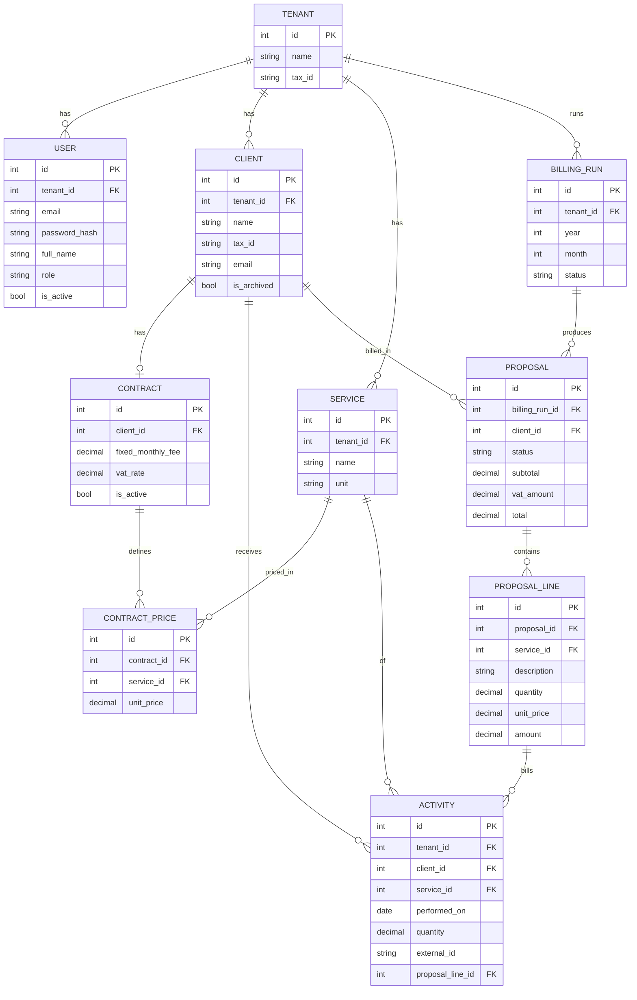

# InvoiceOps — Specs

Turn business activity into billing. A service company records the work done for each client during the month; InvoiceOps applies each client's contract and produces the billing proposals, with every line traceable to the activities behind it.

Scope for the capstone: one complete flow, end to end. Register → clients → contracts → activities → month close → proposal → PDF/CSV.

## 1. User stories (product backlog)

Format: *As a [role], I can [feature] so that [reason].* Each story has acceptance criteria, including the failure case.

Roles: **owner** (creates the company), **admin** (runs billing), **user** (any logged-in person).

### Auth

**US-01** As a business owner, I can register my company and my account so that I can start using InvoiceOps.
- Creates the company (tenant) and the owner user in one step.
- Email already in use → error 409, nothing is created.
- Password shorter than 8 characters → error 400.

**US-02** As a user, I can log in with email and password so that I access my company's data.
- Correct credentials → access token.
- Wrong password or unknown email → error 401 with a generic message.
- Every request with the token only returns data from my company.

**US-03** As a user, I can request a password reset link by email so that I recover access.
- Email sent through a third-party email API.
- Unknown email → same success message (no account enumeration).
- Link expires after 1 hour.

**US-04** As a user, I can set a new password from the reset link.
- Valid link → password updated, old one stops working.
- Expired or tampered link → error 400.

### Clients and contracts

**US-05** As an admin, I can create, edit, list and archive clients so that I can bill them.
- Name is required; tax id and email optional.
- Archived clients are hidden from the month close.
- I never see clients from another company.

**US-06** As an admin, I can define a client's contract (fixed monthly fee, price per service, VAT) so that billing is automatic.
- A contract belongs to one client; one active contract per client.
- Prices have 2 decimals; VAT rate defaults to 21 %.
- A service without a price in the contract cannot be billed.

### Activities

**US-07** As an admin, I can record a completed service for a client (date, service, quantity) so that it gets billed.
- Quantity must be greater than 0; date is required.
- Cannot add activity to a month that is already closed.

**US-08** As an admin, I can import activities from a CSV file so that I don't type them one by one.
- Shows a preview with errors per row before importing.
- Rows with an already imported external id are skipped (no duplicates).
- Malformed file → clear error, nothing imported.

### Month close

**US-09** As an admin, I can generate the billing proposals for a month so that every client gets its invoice draft.
- One proposal per client with activity or with a fixed fee.
- Every proposal line links to the activities it comes from.
- Totals include subtotal, VAT and total.
- Running the close twice for the same month does not duplicate proposals.

**US-10** As an admin, I can review a proposal, see the activities behind each line, and approve it.
- Approving locks its activities so they cannot be billed again.
- An approved proposal cannot be edited.
- Clients with a contract but no activity in the month are flagged.

**US-11** As an admin, I can download a proposal as PDF so that I can send it to my client.
- PDF contains company data, lines, totals and an annex with the activity dates.

**US-12** As an admin, I can export the approved proposals of a month as CSV so that I can import them into my invoicing tool.

### Dashboard

**US-13** As a user, I can see a dashboard with this month's activities, pending proposals and totals so that I know where billing stands.

### Stretch (only if time allows)

**US-14** As an admin, I can paste WhatsApp messages and get suggested activities to confirm, so that I don't retype them.
- Suggestions come from an AI API; nothing is saved until I confirm.
- The AI never calculates prices or totals; the billing engine does.

## 2. Class diagram

Every business table carries `tenant_id` (directly or through its parent) and all queries filter by it: one database, one company per "apartment".

## 3. API

All routes under `/api`. Routes marked 🔒 require `Authorization: Bearer <token>`.

| Method | Route | Body / params | Returns | Story |
|---|---|---|---|---|
| GET | `/health` | — | `{status, database}` | — |
| POST | `/auth/register` | company_name, full_name, email, password | user + token | US-01 |
| POST | `/auth/login` | email, password | token | US-02 |
| GET | `/auth/me` 🔒 | — | current user | US-02 |
| POST | `/auth/forgot-password` | email | generic message | US-03 |
| POST | `/auth/reset-password` | token, password | message | US-04 |
| GET | `/clients` 🔒 | — | list of clients | US-05 |
| POST | `/clients` 🔒 | name, tax_id, email | client | US-05 |
| GET | `/clients/<id>` 🔒 | — | client + contract | US-05 |
| PUT | `/clients/<id>` 🔒 | fields to change | client | US-05 |
| DELETE | `/clients/<id>` 🔒 | — | archives the client | US-05 |
| GET | `/services` 🔒 | — | list of services | US-06 |
| POST | `/services` 🔒 | name, unit | service | US-06 |
| PUT | `/clients/<id>/contract` 🔒 | fixed_monthly_fee, vat_rate, prices[] | contract | US-06 |
| GET | `/activities` 🔒 | ?month=YYYY-MM&client_id | list | US-07 |
| POST | `/activities` 🔒 | client_id, service_id, performed_on, quantity | activity | US-07 |
| POST | `/activities/import` 🔒 | CSV file | preview / import result | US-08 |
| POST | `/billing-runs` 🔒 | year, month | run + proposals | US-09 |
| GET | `/billing-runs/<id>` 🔒 | — | run + proposals | US-09 |
| GET | `/proposals/<id>` 🔒 | — | proposal + lines + activities | US-10 |
| POST | `/proposals/<id>/approve` 🔒 | — | proposal | US-10 |
| GET | `/proposals/<id>/pdf` 🔒 | — | PDF file | US-11 |
| GET | `/billing-runs/<id>/export.csv` 🔒 | — | CSV file | US-12 |
| GET | `/dashboard` 🔒 | — | counters and totals | US-13 |

Errors always return JSON: `{"message": "..."}` with the proper HTTP status (400 invalid data, 401 not logged in, 403 not allowed, 404 not found, 409 conflict).

## 4. Screens (wireframes to sketch)

1. Login / register / forgot password
2. Dashboard
3. Clients list + client detail with contract
4. Activities list + add activity + CSV import
5. Month close: run list → proposal detail with lines and activity annex, approve, PDF

## 5. Tech stack

React 18 + Vite, Context API with Flux-style store (reducer + actions) · Flask 3 + SQLAlchemy 2 + Alembic · PostgreSQL 16 · JWT (flask-jwt-extended) · bcrypt · pytest · third-party APIs: email delivery (password reset) and, as stretch, an AI API for text-to-activities · deployed on Render.
