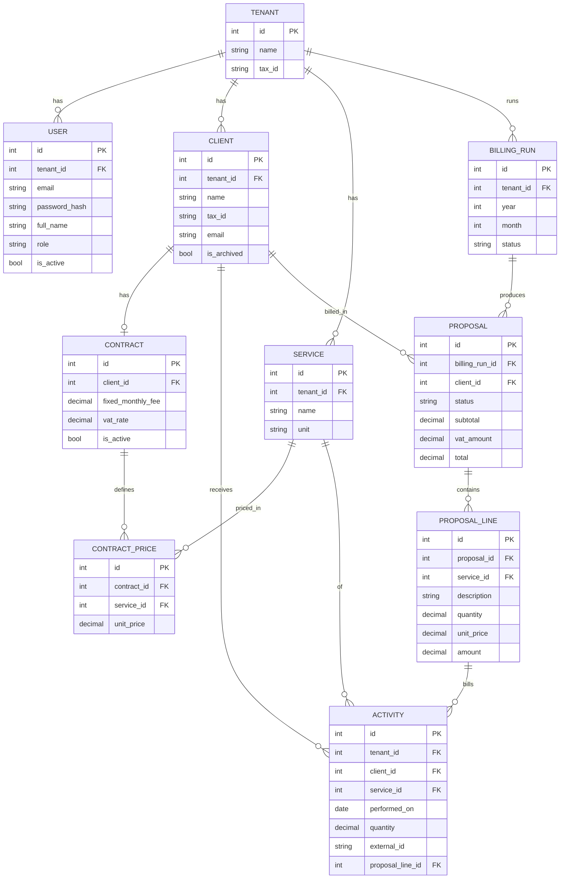

# InvoiceOps — Specs

Turn business activity into billing. A service company records the work done for each client during the month; InvoiceOps applies each client's contract and produces the billing proposals, with every line traceable to the activities behind it.

Scope for the capstone: one complete flow, end to end. Register → clients → contracts → activities → month close → proposal → PDF/CSV.

## 1. User stories (product backlog)

Format: _As a [role], I can [feature] so that [reason]._ Each story has acceptance criteria, including the failure case.

Roles: **owner** (creates the company), **admin** (runs billing), **user** (any logged-in person).

### Auth

**US-01** As a business owner, I can register my company and my account so that I can start using InvoiceOps.

- Creates the company (tenant) and the owner user in one step.
- Email already in use → error 409, nothing is created.
- Password shorter than 8 characters → error 400.

**US-02** As a user, I can log in with email and password so that I access my company's data.

- Correct credentials → access token.
- Wrong password or unknown email → error 401 with a generic message.
- Every request with the token only returns data from my company.

**US-03** As a user, I can request a password reset link by email so that I recover access.

- Email sent through a third-party email API.
- Unknown email → same success message (no account enumeration).
- Link expires after 1 hour.

**US-04** As a user, I can set a new password from the reset link.

- Valid link → password updated, old one stops working.
- Expired or tampered link → error 400.

### Clients and contracts

**US-05** As an admin, I can create, edit, list and archive clients so that I can bill them.

- Name is required; tax id and email optional.
- Archived clients are hidden from the month close.
- I never see clients from another company.

**US-06** As an admin, I can define a client's contract (fixed monthly fee, price per service, VAT) so that billing is automatic.

- A contract belongs to one client; one active contract per client.
- Prices have 2 decimals; VAT rate defaults to 21 %.
- A service without a price in the contract cannot be billed.
- A catalog of standard services of the niche can be added in one go; existing ones (by normalized name) are skipped.

### Activities

**US-07** As an admin, I can record a completed service for a client (date, service, quantity) so that it gets billed.

- Quantity must be greater than 0; date is required.
- Cannot add activity to a month that is already closed.

**US-08** As an admin, I can import activities from a CSV file so that I don't type them one by one.

- Shows a preview with errors per row before importing.
- Rows with an already imported external id are skipped (no duplicates).
- Malformed file → clear error, nothing imported.
- Accepts `,` or `;` as separator, Spanish decimals (`3,5`) and dates in `DD/MM/YYYY` or `YYYY-MM-DD`; client and service names are matched loosely (accents, case, filler words, one close typo).

### Month close

**US-09** As an admin, I can generate the billing proposals for a month so that every client gets its invoice draft.

- One proposal per client with activity or with a fixed fee.
- Every proposal line links to the activities it comes from.
- Totals include subtotal, VAT and total.
- Running the close twice for the same month does not duplicate proposals (409).
- A month with nothing to bill is not closed: error 400 with the list of clients without activity.

**US-10** As an admin, I can review a proposal, see the activities behind each line, and approve it.

- Approving locks its activities so they cannot be billed again.
- An approved proposal cannot be edited.
- Clients with a contract but no activity in the month are flagged.

**US-11** As an admin, I can download a proposal as PDF so that I can send it to my client.

- PDF contains company data, lines, totals and an annex with the activity dates.

**US-12** As an admin, I can export the approved proposals of a month as CSV so that I can import them into my invoicing tool.

### Settings

**US-13b** As an owner, I can edit my company's name and tax id so that they appear as issuer on the PDF proposals.

### Dashboard

**US-13** As a user, I can see a dashboard with this month's activities, pending proposals and totals so that I know where billing stands.

### AI (block 11)

Principle for every AI story: the AI reads and proposes; the billing engine computes; the person confirms. Every AI endpoint returns suggestions only and never writes; the backend re-matches names and re-parses dates and numbers; without an API key the app works and the AI buttons say so (503); a provider failure returns 502.

**US-14** As an admin, I can paste WhatsApp messages and get suggested activities to confirm, so that I don't retype them.

- Suggestions come from an AI API; nothing is saved until I confirm.
- The AI never calculates prices or totals; the billing engine does.
- Each suggestion carries the client and service it resolved to (or the name it read, so I can choose), the date, the quantity and a confidence (Segura / Revisar / Incompleta); I edit rows and create only the ticked ones.
- The prompt lists the dates of the last 7 days as facts, so "ayer" and "lunes" are never computed by the model.

**US-15** As an admin, I can upload a photo of a work sheet, a handwritten note or a chat screenshot and get suggested activities to confirm.

- Same panel and same rows as US-14; png, jpg and webp up to 10 MB.
- Any other file type → error 400, nothing sent to the provider.

**US-16** As an admin, I can upload a voice note and get its transcript plus suggested activities to confirm.

- The audio is transcribed first; the transcript is shown so I can check what the AI heard.
- Any `audio/*` type is accepted (`.m4a`, `.ogg`, `.opus`, `.mp3`, `.wav`).

**US-17** As an admin, I can paste the text of a contract or upload its photo and get the contract form prefilled to review.

- Prefills fixed fee, VAT and the price of each service the company already has.
- Services the AI reads but the company does not have are listed with a "Crear" button (matched to the niche catalog when possible); nothing is saved until I press "Guardar contrato".
- No text and no image → error 400.

**US-19** As an admin, I can get a plain-language explanation of a proposal and a draft email for the client.

- The prompt carries every figure already computed (lines, base, VAT, total); the AI only words them and must use them verbatim.
- Summary and email are shown read-only with copy buttons; nothing is stored.

### Moved to phase 2

**US-18** review of the month before closing (missing visits, duplicates, unpriced services) · **US-20** CSV with any column names · **US-21** learned name aliases · **US-22** month forecast on the dashboard.

## 2. Class diagram

```mermaid
erDiagram
    TENANT ||--o{ USER : has
    TENANT ||--o{ CLIENT : has
    TENANT ||--o{ SERVICE : has
    CLIENT ||--o| CONTRACT : has
    CONTRACT ||--o{ CONTRACT_PRICE : defines
    SERVICE ||--o{ CONTRACT_PRICE : priced_in
    CLIENT ||--o{ ACTIVITY : receives
    SERVICE ||--o{ ACTIVITY : of
    TENANT ||--o{ BILLING_RUN : runs
    BILLING_RUN ||--o{ PROPOSAL : produces
    CLIENT ||--o{ PROPOSAL : billed_in
    PROPOSAL ||--o{ PROPOSAL_LINE : contains
    PROPOSAL_LINE ||--o{ ACTIVITY : bills

    TENANT {
        int id PK
        string name
        string tax_id
    }
    USER {
        int id PK
        int tenant_id FK
        string email
        string password_hash
        string full_name
        string role
        bool is_active
    }
    CLIENT {
        int id PK
        int tenant_id FK
        string name
        string tax_id
        string email
        bool is_archived
    }
    SERVICE {
        int id PK
        int tenant_id FK
        string name
        string unit
    }
    CONTRACT {
        int id PK
        int client_id FK
        decimal fixed_monthly_fee
        decimal vat_rate
        bool is_active
    }
    CONTRACT_PRICE {
        int id PK
        int contract_id FK
        int service_id FK
        decimal unit_price
    }
    ACTIVITY {
        int id PK
        int tenant_id FK
        int client_id FK
        int service_id FK
        date performed_on
        decimal quantity
        string external_id
        int proposal_line_id FK
    }
    BILLING_RUN {
        int id PK
        int tenant_id FK
        int year
        int month
        string status
    }
    PROPOSAL {
        int id PK
        int billing_run_id FK
        int client_id FK
        string status
        decimal subtotal
        decimal vat_amount
        decimal total
    }
    PROPOSAL_LINE {
        int id PK
        int proposal_id FK
        int service_id FK
        string description
        decimal quantity
        decimal unit_price
        decimal amount
    }
```

Every business table carries `tenant_id` (directly or through its parent) and all queries filter by it: one database, one company per "apartment".

## 3. API

All routes under `/api`. Routes marked 🔒 require `Authorization: Bearer <token>`.

| Method | Route                               | Body / params                                               | Returns                                                                                                                                                  | Story               |
| ------ | ----------------------------------- | ----------------------------------------------------------- | -------------------------------------------------------------------------------------------------------------------------------------------------------- | ------------------- |
| GET    | `/health`                           | —                                                           | `{status, database}`                                                                                                                                     | —                   |
| POST   | `/auth/register`                    | company_name, full_name, email, password                    | user + token                                                                                                                                             | US-01               |
| POST   | `/auth/login`                       | email, password                                             | token                                                                                                                                                    | US-02               |
| GET    | `/auth/me` 🔒                       | —                                                           | current user                                                                                                                                             | US-02               |
| GET    | `/auth/tenant` 🔒                   | —                                                           | company `{id, name, tax_id}`                                                                                                                             | US-13b              |
| PUT    | `/auth/tenant` 🔒                   | name, tax_id                                                | company                                                                                                                                                  | US-13b              |
| POST   | `/auth/forgot-password`             | email                                                       | generic message                                                                                                                                          | US-03               |
| POST   | `/auth/reset-password`              | token, password                                             | message                                                                                                                                                  | US-04               |
| GET    | `/clients` 🔒                       | —                                                           | list of clients                                                                                                                                          | US-05               |
| POST   | `/clients` 🔒                       | name, tax_id, email                                         | client                                                                                                                                                   | US-05               |
| GET    | `/clients/<id>` 🔒                  | —                                                           | client + contract                                                                                                                                        | US-05               |
| PUT    | `/clients/<id>` 🔒                  | fields to change                                            | client                                                                                                                                                   | US-05               |
| DELETE | `/clients/<id>` 🔒                  | —                                                           | archives the client                                                                                                                                      | US-05               |
| GET    | `/services` 🔒                      | —                                                           | list of services                                                                                                                                         | US-06               |
| POST   | `/services` 🔒                      | name, unit                                                  | service                                                                                                                                                  | US-06               |
| GET    | `/services/catalog` 🔒              | —                                                           | standard services + `exists`                                                                                                                             | US-06               |
| POST   | `/services/catalog` 🔒              | names[]                                                     | `{created, skipped}`                                                                                                                                     | US-06               |
| PUT    | `/clients/<id>/contract` 🔒         | fixed_monthly_fee, vat_rate, prices[]                       | contract                                                                                                                                                 | US-06               |
| GET    | `/activities` 🔒                    | ?month=YYYY-MM&client_id                                    | list                                                                                                                                                     | US-07               |
| POST   | `/activities` 🔒                    | client_id, service_id, performed_on, quantity               | activity                                                                                                                                                 | US-07               |
| POST   | `/activities/import` 🔒             | CSV file, `?commit=true` to save                            | preview / import result                                                                                                                                  | US-08               |
| POST   | `/activities/suggest` 🔒            | JSON `{text}` or multipart `text` + `file` (image or audio) | `{suggestions[], transcript}`; never saves                                                                                                               | US-14, US-15, US-16 |
| POST   | `/clients/<id>/contract/suggest` 🔒 | JSON `{text}` or multipart `text` + `file` (image)          | `{fixed_monthly_fee, vat_rate, services[]}`; never saves                                                                                                 | US-17               |
| GET    | `/billing-runs` 🔒                  | —                                                           | list of runs                                                                                                                                             | US-09               |
| POST   | `/billing-runs` 🔒                  | month (YYYY-MM)                                             | run + proposals + clients_without_activity; 400 if nothing to bill, 409 if already closed                                                                | US-09               |
| GET    | `/billing-runs/<id>` 🔒             | —                                                           | run + proposals                                                                                                                                          | US-09               |
| GET    | `/proposals/<id>` 🔒                | —                                                           | proposal + lines + activities                                                                                                                            | US-10               |
| POST   | `/proposals/<id>/approve` 🔒        | —                                                           | proposal                                                                                                                                                 | US-10               |
| GET    | `/proposals/<id>/pdf` 🔒            | —                                                           | PDF file                                                                                                                                                 | US-11               |
| GET    | `/proposals/<id>/explain` 🔒        | —                                                           | `{summary, email_subject, email_body}`                                                                                                                   | US-19               |
| GET    | `/billing-runs/<id>/export.csv` 🔒  | —                                                           | CSV file                                                                                                                                                 | US-12               |
| GET    | `/dashboard` 🔒                     | ?month=YYYY-MM (default: current month)                     | `{month, active_clients, activities: {total, unbilled}, billing_run, clients_without_activity, proposals: {draft, approved}, totals: {draft, approved}}` | US-13               |

Errors always return JSON: `{"message": "..."}` with the proper HTTP status (400 invalid data, 401 not logged in, 403 not allowed, 404 not found, 409 conflict, 503 AI not configured, 502 AI provider error).

## 4. Screens

1. Login / register / forgot password
2. Dashboard
3. Clients list + client detail with contract and service catalog; "Rellenar con IA desde el contrato" panel
4. Activities list + add activity + CSV import + "Sugerir con IA" panel (text, photo, voice note)
5. Month close: run list → proposal detail with lines and activity annex, approve, PDF; "Explicar con IA" card
6. Settings: company name and tax id

Design notes and the final look: `docs/DESIGN.md`.

## 5. Demo data

`pipenv run seed` loads the demo company (`src/api/commands.py`): Limpiezas Aurora S.L. (owner `july@limpiezasaurora.es` / `Aurora2026!`), three services, four clients with contracts (one with a contract and no activity), 38 activities in September 2026 and 12 in early October. It does nothing if the company already exists; `pipenv run seed --reset` deletes it and loads it again.

## 6. Tech stack

React 18 + Vite, Context API with Flux-style store (reducer + actions) · Flask 3 + SQLAlchemy 2 + Alembic · PostgreSQL 16 · JWT (flask-jwt-extended) · bcrypt · pytest · third-party APIs: Brevo (password-reset email) and OpenAI (chat completions with images, audio transcription; REST, no SDK; prompts in Spanish, JSON answers) · fpdf2 for the PDF · deployed on Render (Blueprint, auto-deploy from `main`).
